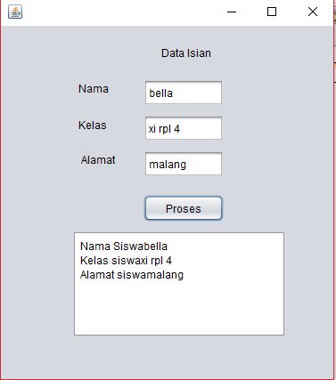
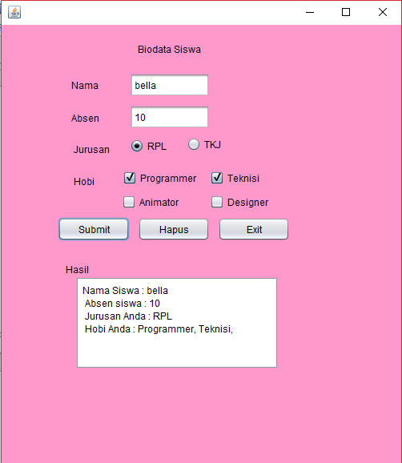
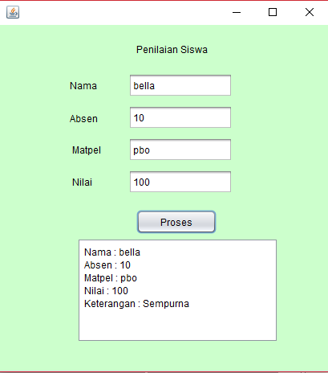
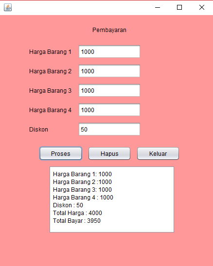

# Modul5GUI

Deskripsi : Script diatas digunakan untuk menampilkan kembali apa yang telah diperintahkan dan yang telah diinputkan 

.PNG)

Deskripsi : Pada Script diatas digunakan untuk menampilkan kembali apa yang telah diperintahkan dan di inputkan (hampir sama seperti latihan2) tetapi disini ditambahkan operator untuk mengolah angka angka yang telah diinputkan 

Deskripsi : Pada script diatas digunakan untuk menampilkan data lengkap beserta hobi dan jurusannya , untuk hobi menggunakan checkbox, dan untuk jurusan digunakan Radio Button

Deskripsi : Script diatas menampilkan data siswa yang telah diolah, digunakan untuk menentukan nilai siswa termasuk kedalam tingkat apa 

Deskripsi : Script diatas digunakan untuk menghitung harga suatu barang yang mendapatkan diskon, sebelumnya ada perintah untuk menampilkan harga setiap barang, dan juga ada total harga dimana harga setiap harga dijumlah dengan harga lainnya 
